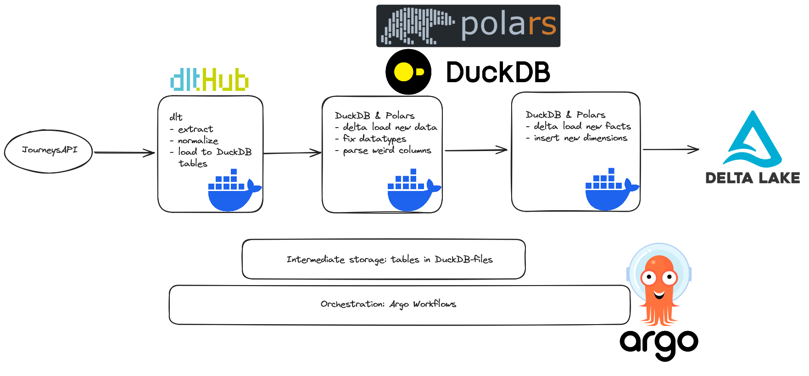

# JourneysAPI pipeline
Simple example of an ELT pipeline using dlt for ingesting Tampere public transit data from the JourneysAPI, DuckDB for intermediate storage, and DuckDB and Polars for transformations. Done as an exercise to see how the technologies might fit together and to find possible pitfalls and shortcomings of the stack.

Each stage can be run as a standalone script or packaged as its own Docker container with a provided Dockerfile. Orchestration the entire pipeline of containers done with Argo Workflows.



---

## Pipeline steps

- Step 1:
  - GET request data from JourneysAPI's Vehicle Activity endpoint.
  - Denormalize and load the response to a DuckDB database with dlt.
  - Retry loading three times. If loading fails all three times, try to load into a fallback DuckDB database instead. Main reason why loading can fail is the DuckDB database file being locked due to another process accessing it.
- Step 2:
  - Check last load id from a metadata table and get all new rows from the previous layer.
  - Rename columns, fix datatypes, parse departure times from `HHMM` format to polars.Time datatype, parse delays from `-P0Y0M0DT0H3M20.000S` format to seconds in polars.Int64 datatype, add current timestamp as `update_time`, and drop unneeded columns.
  - In a single transaction:
    - Recreate metadata table and target table if corresponding environment variable is set.
    - Upsert new data and insert new load id.
- Step 3:
  - Get max `update_time` from target Delta table and get all newer rows from previous stage.
  - Merge new data to taget Delta table.
  - TODO: Insert new dimensions to Delta tables for dimensions.

---

## Run pipeline once with Argo (and Minikube)

Quick setup with shell scripts to get Argo running in Minikube locally:
- First, make the scripts executable:
```
chmod +x install-deps.sh
chmod +x build-images.sh
```
- `install-deps.sh` script installs Minikube if it is not installed and starts it, then installs the Argo CLI if it is not installed, and finally starts Argo in k8s:
```
./install-deps.sh
```
- `build-images.sh` script builds all the images in a way that lets Minikube run the local images (see [the handbook](https://minikube.sigs.k8s.io/docs/handbook/pushing/#1-pushing-directly-to-the-in-cluster-docker-daemon-docker-env)), then it creates secrets in the argo-namespace from the needes env-files, and finally it creates a persistent volume and a persistent volume claim that the Argo workflow uses:
```
./build-images.sh
```
- Now you can run and monitor a single execution of the workflow with
```
argo submit -n argo --watch argo/elt-workflow.yaml
```
- After the run, you can see the logged output with:
```
argo logs -n argo @latest
```

---

## Run pipeline on a schedule with Argo

- To run the workflow on a schedule, create a cron workflow as defined in the file `argo/elt-scheduled.yaml` with
```
argo cron create -n argo argo/elt-scheduled.yaml
```
- You can see a list of all cron workflows
```
argo cron -n argo list
```
- To see information about the specific cron workflow for this pipeline
```
argo cron -n argo get elt-scheduled-workflow
```
- While the scheduled workflow is running, you can start monitoring it with
```
argo watch -n argo @latest
```
- and you can get the logs of the latest run just like for the non-scheduled workflow with
```
argo logs -n argo @latest
```
- If you want to pause the scheduling, run
```
argo cron -n argo suspend elt-scheduled-workflow
```
- and you can then resume with
```
argo cron -n argo resume elt-scheduled-workflow
```
- Finally you can delete the schedule with
```
argo cron -n argo delete elt-scheduled-workflow
```

**NOTE**: The data is not persisted in a local directory. It is persisted in Minikube's container, in the directory `/data/pipeline-data`. It should be persisted through restarts. To get access to the persisted files, you can ssh into the VM with `minikube ssh`, or you could create a pod that claims the volume and then access the pod to inspect the files.

---

## Manual steps for installation

Manual steps for getting Argo running in Minikube locally and running the pipeline. All the steps assume you are running them from the directory this README is in.
- First, install Minikube:
```
curl -LO https://storage.googleapis.com/minikube/releases/latest/minikube-linux-amd64
sudo install minikube-linux-amd64 /usr/local/bin/minikube && rm minikube-linux-amd64
```
- and then start Minikube:
```
minikube start
```
- Then, install Argo CLI (not needed if using Argo UI):
```
curl -sLO https://github.com/argoproj/argo-workflows/releases/download/v3.5.5/argo-linux-amd64.gz
gunzip argo-linux-amd64.gz
chmod +x argo-linux-amd64
sudo mv ./argo-linux-amd64 /usr/local/bin/argo
```
- and start Argo in k8s:
```
kubectl create namespace argo
kubectl apply -n argo -f https://github.com/argoproj/argo-workflows/releases/download/v3.5.5/quick-start-minimal.yaml
```
- If you want to use the Argo UI, forward the port:
```
kubectl -n argo port-forward service/argo-server 2746:2746
```
- To build the container images in a way that Minikube can use them locally (see [the handbook](https://minikube.sigs.k8s.io/docs/handbook/pushing/#1-pushing-directly-to-the-in-cluster-docker-daemon-docker-env)), first run
```
eval $(minikube docker-env)
```
- After the above command, build the images _in the same shell session_.
- Create secrets in k8s from the env files in `silver/` and `gold/`:
```
kubectl create secret generic transform-env --from-env-file=silver/env --namespace=argo
kubectl create secret generic export-env --from-env-file=gold/env --namespace=argo
```
- Create a persistent volume and claim for the workflow:
```
kubectl apply -n argo -f argo/persistent-volume.yaml
kubectl apply -n argo -f argo/persistent-volume-claim.yaml
```
- Now you are ready to run and monitor the workflow for the pipeline:
```
argo submit -n argo --watch argo/elt-workflow.yaml
```
- After the run, you can see the logged output with:
```
argo logs -n argo @latest
```

---

## Running steps with Docker instead of Argo

Steps for building the images and running the stages one at a time `docker run`:
- Make/choose a directory you want to store all the data in, e.g. `data/`. _Run all the containers from this directory._
- Bronze:
  - Build the container image in `bronze/` with e.g.: `docker build -t ingest:0.1 .`
  - Run the container with the data directory bind mounted to persist the results and metadata. For example, cd into the data directory and run `docker run --rm --mount type=bind,src="$(pwd)",target=/data ingest:0.1` This binds the current directory to the containers `data/` directory where the results and metadata are stored.
  - The container prints out some info about the ingestion. You might want to pipe this to a log file.
- Silver:
  - Build the container image in `silver/` with e.g.: `docker build -t transform:0.1 .`
  - Run the container with the data directory bind mounted to persist the results like with the bronze container. Include an env-file to pass the environment variables needed. For example, if your data directory is directly under the root directory of this repo, then you can use the env-file in `silver/` by running `docker run --rm --mount type=bind,src="$(pwd)",target=/data --env-file ../silver/env transform:0.1`
  - The container prints out info about the loaded and transformed data. You might want to pipe this to a log file.
- Gold:
  - Build the container image in `gold/` with e.g.: `docker build -t export:0.1 .`
  - Run the container with the data directory bind mounted again. Include an env-file to pass the environment variables needed. For example, if your data directory is directly under the root directory of this repo, then you can use the env-file in `gold/` by running `docker run --rm --mount type=bind,src="$(pwd)",target=/data --env-file ../gold/env export:0.1`
  - The container prints out info about the data exported from the silver DuckDB database to the final Delta table. You might want to pipe this to a log file.

---

## TODO

- Add dimensions to corresponding Delta tables.
- Add cleaning up the final Delta table to the pipeline `clean_delta_table/optimize_and_vacuum.py`.
- Add data quality monitoring.
- Add another branch to pipeline for utilizing data for bus stops.
